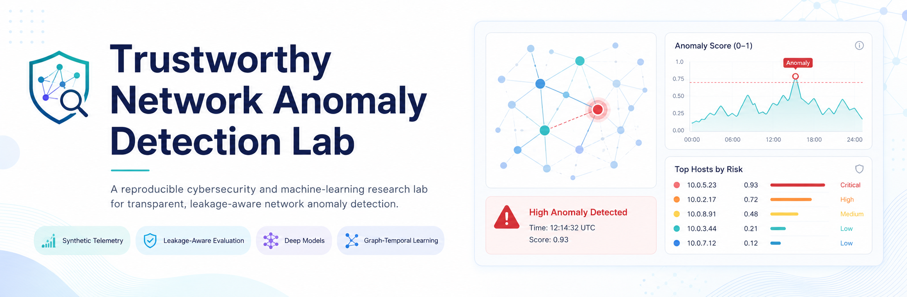
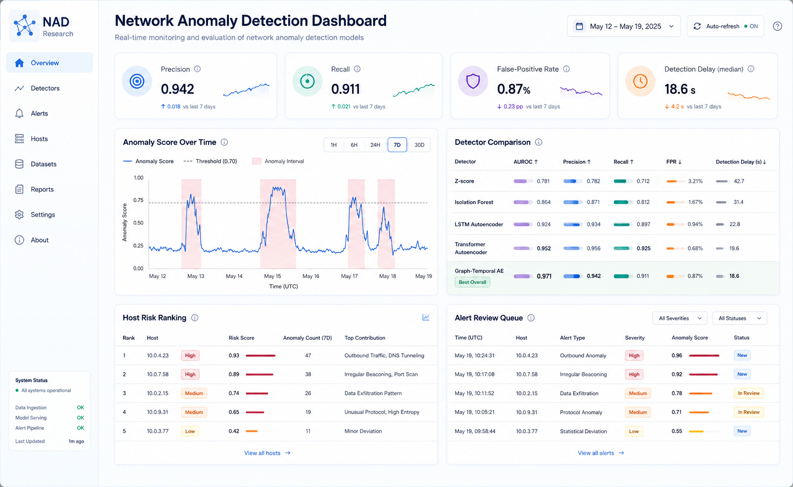
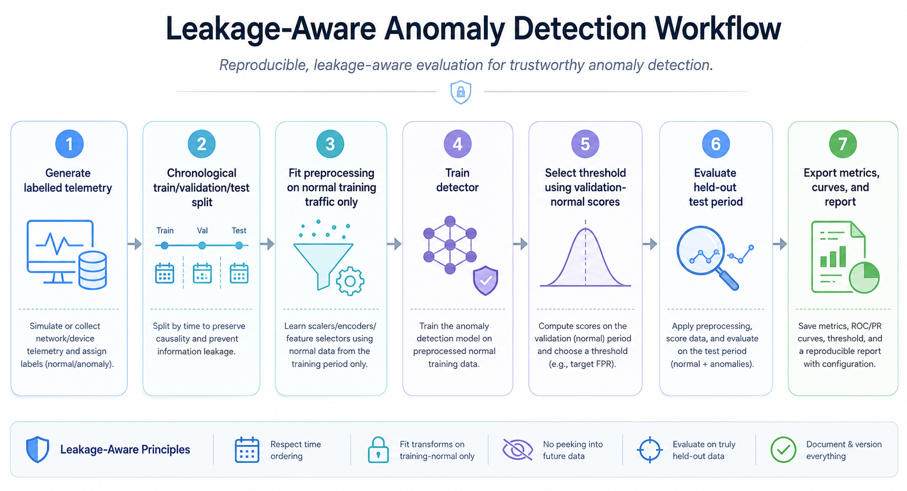
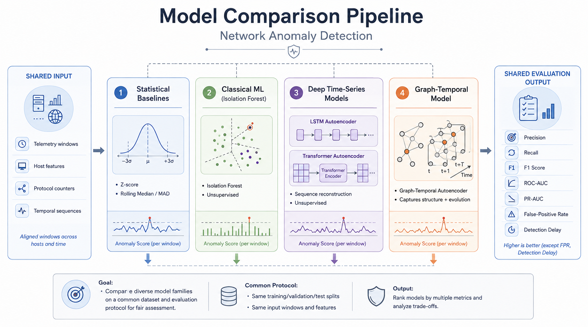

<p align="center">
  
</p>

<h1 align="center">Trustworthy Network Anomaly Detection Lab</h1>

<p align="center">
  <b>A reproducible cybersecurity and machine-learning research lab for detecting anomalous network behavior with transparent baselines, deep sequence models, graph-temporal learning, and academically defensible evaluation.</b>
</p>

<p align="center">
  
  
  
  
  
</p>

---

## Overview

**Trustworthy Network Anomaly Detection Lab** is a research-oriented cybersecurity project for detecting unusual behavior in multi-host network telemetry. It combines classical statistical baselines, machine-learning detectors, deep time-series autoencoders, and graph-temporal modeling into a single reproducible experimental workflow.

The project is designed for academic and PhD-level experimentation where the goal is not only to get a high score, but to build a detection pipeline that is **transparent, reproducible, leakage-aware, and easy to audit**.

The default dataset in this repository is **synthetic**. Results should be interpreted as performance on the configured generator and should not be presented as evidence of real enterprise-network performance without external validation.

<p align="center">
  
</p>

---

## Research problem

Modern networks produce high-volume telemetry from hosts, services, authentication flows, traffic counters, protocol behavior, and system events. Security teams need systems that can detect abnormal activity while avoiding excessive false alarms.

This repository studies questions such as:

- Can transparent statistical baselines remain competitive under controlled anomaly settings?
- When do deep sequence models improve detection over simpler methods?
- How does host-aware context affect false positives and detection delay?
- Can graph-temporal models capture multi-host dependencies better than isolated host models?
- How should thresholds be selected without leaking information from the test period?
- Which metrics best explain the trade-off between sensitivity and operational usability?

---

## Key capabilities

| Capability | Description |
|---|---|
| Synthetic telemetry generator | Creates labelled multi-host network telemetry for controlled experiments. |
| Chronological splitting | Separates train, validation, and test periods to reduce temporal leakage. |
| Transparent baselines | Includes Z-score and host-aware rolling median/MAD detectors. |
| Classical ML baseline | Includes Isolation Forest for unsupervised anomaly detection. |
| Deep sequence models | Includes LSTM and Transformer autoencoder workflows. |
| Graph-temporal modeling | Represents multi-host relationships through graph-aware temporal learning. |
| Evaluation metrics | Reports precision, recall, F1, ROC-AUC, PR-AUC, false-positive rate, detection delay, and missed runs. |
| Repeated-seed benchmarking | Supports repeated experiments for more stable comparison. |
| MATLAB analysis | Includes MATLAB-oriented result analysis and visualization workflow. |

---

## Research workflow

<p align="center">
  
</p>

```text
Generate labelled telemetry
→ Create chronological train / validation / test periods
→ Fit preprocessing on normal training traffic only
→ Train or fit detector
→ Select threshold from normal validation scores
→ Evaluate the held-out test period
→ Export metrics, scores, and curves
→ Analyze repeated-seed results and figures
```

---

## Model family

<p align="center">
  
</p>

| Category | Methods | Research value |
|---|---|---|
| Statistical baselines | Z-score, rolling median/MAD | Transparent, fast, interpretable, useful sanity checks. |
| Classical machine learning | Isolation Forest | Strong unsupervised baseline for tabular anomaly detection. |
| Deep time-series models | LSTM autoencoder, Transformer autoencoder | Captures temporal reconstruction patterns and sequence deviations. |
| Multi-host dependency model | Graph-temporal autoencoder | Tests whether network relationships improve anomaly detection. |

---

## Evaluation metrics

The project emphasizes evaluation beyond a single accuracy score.

| Metric | Why it matters |
|---|---|
| Precision | Measures how many alerts are useful rather than noisy. |
| Recall | Measures how many labelled anomalies are detected. |
| F1-score | Summarizes precision-recall balance. |
| ROC-AUC | Measures ranking quality across thresholds. |
| PR-AUC | Useful for imbalanced anomaly detection settings. |
| False-positive rate | Critical for security operations usability. |
| Detection delay | Measures how quickly anomaly runs are detected. |
| Missed anomaly runs | Captures complete failure to detect attack episodes. |

---

## Repository structure

```text
network-anomaly-detection/
├── README.md
├── requirements.txt
├── assets/
│   ├── banner.png
│   ├── detection-dashboard.png
│   ├── model-pipeline.png
│   └── research-workflow.png
├── configs/
│   └── Reproducible experiment settings
├── src/nadlab/
│   └── Data, preprocessing, baselines, models, training, metrics, pipeline
├── scripts/
│   └── Data generation, experiments, benchmarks, and Python figures
├── matlab/
│   └── MATLAB result analysis and statistical comparison scripts
├── notebooks/
│   └── Jupyter research walkthroughs
├── paper/
│   └── Report and manuscript structure
├── docs/
│   ├── architecture.md
│   ├── benchmarking-plan.md
│   ├── research-protocol.md
│   └── threat-model.md
└── tests/
    └── Unit tests for data, metrics, models, and pipeline behavior
```

---

## Quick start

### 1. Clone the repository

```bash
git clone https://github.com/Hirakhyzer/network-anomaly-detection.git
cd network-anomaly-detection
```

### 2. Create a virtual environment

```bash
python -m venv .venv
```

Windows activation:

```bat
.venv\Scripts\activate
```

macOS/Linux activation:

```bash
source .venv/bin/activate
```

### 3. Install dependencies

```bash
python -m pip install --upgrade pip
python -m pip install -r requirements.txt
```

---

## Run experiments

Generate only the dataset:

```bash
python scripts/generate_data.py
```

Run a transparent statistical baseline:

```bash
python scripts/run_experiment.py --model zscore
```

Run individual deep models:

```bash
python scripts/run_experiment.py --model lstm_ae
python scripts/run_experiment.py --model transformer_ae
python scripts/run_experiment.py --model graph_temporal_ae
```

Run every configured model:

```bash
python scripts/run_experiment.py --model all
```

Create Python figures:

```bash
python scripts/plot_results.py --results results
```

Run a repeated-seed benchmark:

```bash
python scripts/run_benchmark.py --seeds 42 43 44
```

---

## MATLAB analysis

After Python results exist, use the MATLAB analysis scripts:

```matlab
addpath('matlab')
analyze_results('results')
plot_roc_comparison('results')
statistical_significance_test('results/benchmark')
```

---

## Testing

```bash
pytest
```

The test suite is intended to validate telemetry generation, chronological splits, windowing, baselines, metrics, and output shapes for PyTorch models.

---

## Academic safeguards

This repository is designed around careful research practice:

1. **No test-period tuning** — thresholds should be selected using validation behavior, not the held-out test period.
2. **Normal-only preprocessing** — preprocessing should be fitted on normal training traffic only.
3. **Chronological evaluation** — temporal ordering should be preserved to reduce leakage.
4. **Repeated seeds** — benchmark comparisons should be repeated when possible.
5. **Transparent reporting** — report generator parameters, seeds, hardware, metrics, and limitations.
6. **External validation** — publication-oriented claims should be tested on licensed public datasets or real telemetry where permitted.

---

## Research use cases

### Cybersecurity research

Use the project to compare anomaly detection methods under controlled attack-injection settings, study false-positive behavior, and evaluate detection delay.

### Machine learning experimentation

Use the pipeline to compare statistical, classical ML, sequence-model, and graph-temporal anomaly detection approaches under the same splits and metrics.

### PhD or thesis work

Use the repository as a starting point for experiments on trustworthy anomaly detection, temporal leakage, explainability, graph-based security analytics, or operational alert quality.

### Teaching and labs

Use the synthetic generator and transparent baselines to demonstrate anomaly detection without exposing private network traffic.

---

## Roadmap

### Phase 1 — Research foundation

- [x] Synthetic telemetry generation
- [x] Chronological evaluation workflow
- [x] Statistical and ML baselines
- [x] Deep sequence model scaffold
- [x] Reproducible experiment commands

### Phase 2 — Trustworthy evaluation

- [ ] Add calibration plots for threshold stability
- [ ] Add per-host false-positive analysis
- [ ] Add anomaly-run detection-delay visualizations
- [ ] Add repeated-seed confidence intervals
- [ ] Add ablation analysis templates

### Phase 3 — Advanced graph-security modeling

- [ ] Add dynamic host-correlation graph construction
- [ ] Add graph explanation summaries
- [ ] Add attack path visualization
- [ ] Add graph drift detection
- [ ] Add relation-aware reconstruction diagnostics

### Phase 4 — Publication readiness

- [ ] Add external dataset adapter
- [ ] Add experiment registry
- [ ] Add model cards
- [ ] Add full paper-ready table export
- [ ] Add reproducibility checklist

---

## Ethical and security notice

This repository is intended for defensive cybersecurity research, education, and reproducible machine-learning experimentation. It should not be used to hide malicious activity, bypass monitoring, or claim real-world detection performance without proper validation.

When working with real network telemetry, remove sensitive identifiers, follow institutional data policies, and document dataset permissions.

---

## Citation

If this repository supports your academic work, cite it using the metadata in `CITATION.cff`.

---

## License

This project is released under the MIT License.

---

## Author

Created by **Hira Khyzer** as a research-focused cybersecurity and machine-learning project.

<p align="center">
  <b>Trustworthy Network Anomaly Detection Lab — make anomaly detection reproducible, interpretable, and research-ready.</b>
</p>
