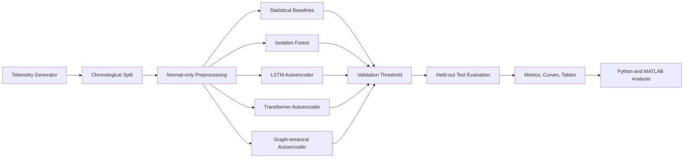

# System Architecture

This document describes the research architecture of **Trustworthy Network Anomaly Detection Lab**.

## Design goals

The project is designed around four goals:

1. **Reproducibility** — experiments should be repeatable through configuration files, seeds, and documented commands.
2. **Leakage control** — preprocessing, threshold selection, and model evaluation should respect train/validation/test separation.
3. **Baseline accountability** — deep models should be compared against transparent statistical and classical machine-learning baselines.
4. **Research extensibility** — new models, metrics, and datasets should be added without changing the evaluation protocol.

## High-level pipeline

## Components

### Data layer

The data layer is responsible for producing or loading telemetry tables. In the prototype, the default workflow uses synthetic multi-host telemetry so experiments can be run without exposing real network data.

### Split layer

The split layer preserves chronological order. This is important because random splitting can leak temporal context and make anomaly detection performance look stronger than it is.

### Preprocessing layer

Preprocessing should be fitted only on normal training traffic. This avoids teaching the scaler or transformer about anomaly-period distributions.

### Detector layer

Detector families include:

- Statistical baselines.
- Classical unsupervised machine learning.
- Deep reconstruction-based sequence models.
- Graph-temporal approaches for multi-host context.

### Threshold layer

Thresholds should be selected from validation scores, preferably normal validation scores or another pre-declared validation rule.

### Evaluation layer

Evaluation is performed on the held-out test period and should include alert quality, ranking quality, and temporal usefulness.

## Extension points

New research modules can be added by implementing:

- A dataset adapter.
- A model/detector interface.
- A scoring function.
- A threshold-selection strategy.
- A result export format.

## Research risks

The main risks are data leakage, overfitting to a synthetic generator, unstable repeated-seed performance, and presenting prototype results as real-world security performance. These risks should be handled explicitly in reports and manuscripts.
